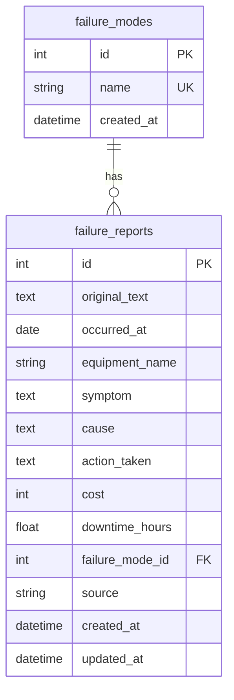

# DB設計書

> IPO と Data 一覧から、効果的なDB設計を作成

## テーブル一覧

| テーブル名 | 目的 | 関連データ項目 |
|-----------|------|--------------|
| failure_reports | 故障レコードの本体。LLMで構造化された故障情報を格納する | レコードID, 元テキスト, 発生日, 設備名, 現象, 原因, 対策, コスト, 停止時間, 故障モード, 登録日時, データソース |
| failure_modes | 故障モードのマスタ。故障モードの種類を管理し、正規化と分析の一貫性を担保する | 故障モードID, 故障モード名 |

## ER図

## 設計方針

### 正規化の判断

- **故障モード（failure_modes）を分離**: 故障モードは円グラフでの集計やフィルタリングで頻繁に使用される。マスタテーブルとして分離することで、表記揺れを防ぎ、一貫した分析を可能にする
- **設備名は正規化しない**: MVPではマスタ管理の複雑さを避け、failure_reports のカラムとして保持する。将来的に設備マスタが必要になった場合に分離可能
- **1テーブル中心のシンプル設計**: MVPとしてコアデータは failure_reports に集約し、実装コストを最小化

### パフォーマンス考慮

- occurred_at にインデックスを付与（月次トレンドのGROUP BYで頻繁に使用）
- failure_mode_id にインデックスを付与（故障モード別集計で使用）
- equipment_name にインデックスを付与（コストTOP10の集計・検索で使用）

## テーブル詳細

### failure_modes

**目的**: 故障モードのマスタ管理。表記揺れを防ぎ、分析の一貫性を担保する。

| カラム | 型 | 制約 | 説明 |
|-------|-----|------|------|
| id | INTEGER | PK, AUTOINCREMENT | 主キー |
| name | VARCHAR(100) | NOT NULL, UNIQUE | 故障モード名（劣化, 破損, 動作不良, 漏れ, 過熱 等） |
| created_at | DATETIME | DEFAULT CURRENT_TIMESTAMP | 作成日時 |

**初期データ（シード）:**

| id | name |
|----|------|
| 1 | 劣化 |
| 2 | 破損 |
| 3 | 動作不良 |
| 4 | 漏れ |
| 5 | 過熱 |
| 6 | 腐食 |
| 7 | 摩耗 |
| 8 | 電気系統故障 |
| 9 | その他 |

### failure_reports

**目的**: LLMで構造化された故障レコードの本体。全画面のデータソースとなるコアテーブル。

| カラム | 型 | 制約 | 説明 |
|-------|-----|------|------|
| id | INTEGER | PK, AUTOINCREMENT | 主キー |
| original_text | TEXT | NOT NULL | ユーザーが入力した自由記述の故障報告テキスト |
| occurred_at | DATE | NOT NULL, INDEX | 故障発生日 |
| equipment_name | VARCHAR(200) | NOT NULL, INDEX | 設備名 |
| symptom | TEXT | NOT NULL | 現象・症状 |
| cause | TEXT | | 原因（LLMが抽出できない場合はNULL） |
| action_taken | TEXT | | 対策・修理内容（LLMが抽出できない場合はNULL） |
| cost | INTEGER | | コスト（円）。NULLは不明を意味する |
| downtime_hours | FLOAT | | 停止時間（時間単位）。NULLは不明を意味する |
| failure_mode_id | INTEGER | FK(failure_modes.id), INDEX | 故障モードへの外部キー |
| source | VARCHAR(20) | NOT NULL, DEFAULT 'manual' | データソース（'manual': 手動入力, 'sample': サンプル投入） |
| created_at | DATETIME | DEFAULT CURRENT_TIMESTAMP | 登録日時 |
| updated_at | DATETIME | DEFAULT CURRENT_TIMESTAMP | 更新日時 |

### 主要クエリパターン

| 用途 | クエリ概要 |
|------|----------|
| 故障モード別内訳 | `SELECT fm.name, COUNT(*) FROM failure_reports fr JOIN failure_modes fm ON fr.failure_mode_id = fm.id GROUP BY fm.name` |
| 月次トレンド | `SELECT strftime('%Y-%m', occurred_at), COUNT(*) FROM failure_reports GROUP BY 1 ORDER BY 1` |
| コストTOP10 | `SELECT equipment_name, SUM(cost) FROM failure_reports GROUP BY equipment_name ORDER BY 2 DESC LIMIT 10` |
| KPI算出 | `SELECT COUNT(*), SUM(cost), AVG(downtime_hours) FROM failure_reports` |
| キーワード検索 | `SELECT * FROM failure_reports WHERE equipment_name LIKE ? OR symptom LIKE ? OR cause LIKE ? OR action_taken LIKE ?` |

---

## 次のステップ

→ `/design-requirements-v2` で要件定義書を更新する
