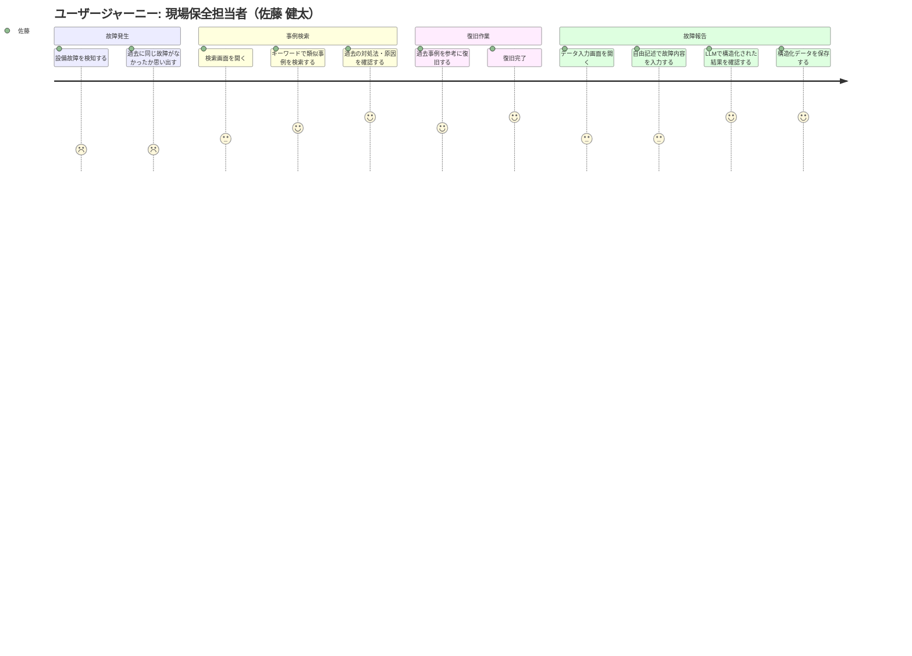
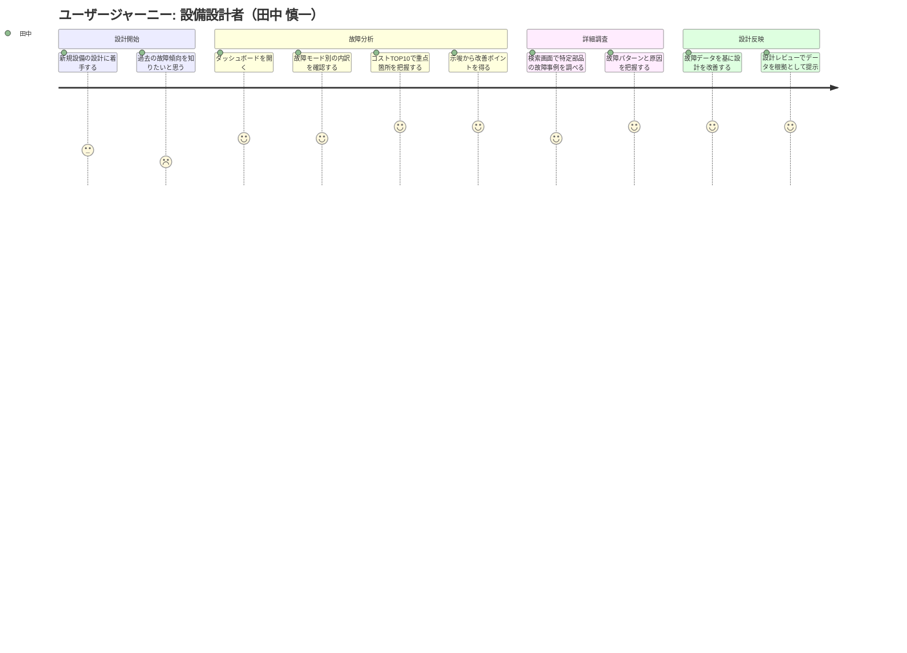
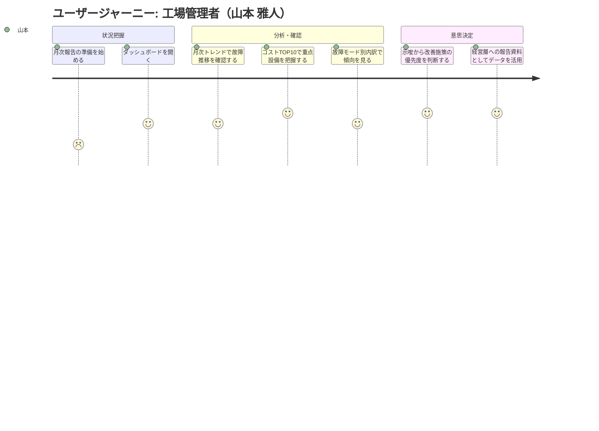

# ユーザージャーニー

---

## ペルソナ 1: 現場保全担当者（佐藤 健太）

| 項目 | 内容 |
|-----|------|
| ペルソナ | 佐藤 健太（現場保全担当者） |
| ユーザー像 | 30代、保全技術者。設備の点検・修理に精通。PCは基本操作レベル |
| 課題 | 過去事例の検索に時間がかかる、自由記述の報告が後から活用できない |
| 利用シーン | 故障発生時の事例検索、日次の故障報告入力、月次振り返り |

### ジャーニーマップ

### メインフロー

| # | フェーズ | 行動 | 課題・感情 | 解決 |
|---|---------|------|----------|------|
| 1 | 故障発生 | 設備故障を検知し、過去事例を思い出そうとする | 「前にも同じ故障があったはず…」焦り | - |
| 2 | 事例検索 | 検索画面でキーワード検索し、類似事例を見つける | 過去はOracle DBを検索する手段がなかった | 検索画面で即座に類似事例にアクセス |
| 3 | 復旧作業 | 過去の対処法を参考に復旧作業を実施 | 経験の浅いメンバーも対応可能に | 過去事例の知見が共有される |
| 4 | 故障報告 | 自由記述で入力 → LLMが構造化 → 確認・保存 | 自由記述が分析に使えない | LLMが自動で構造化し、再利用可能に |

### 感情の変化

- **開始時**: 故障発生で焦り、過去事例が見つからず不安（スコア: 2）
- **最初のつまずき**: 以前はDBを直接検索できず、ベテランに聞くしかなかった（スコア: 2）
- **ブレークスルー**: 検索画面で類似事例がすぐ見つかり、安心感（スコア: 5）
- **ゴール達成時**: 報告書も構造化されて保存でき、次の人にも役立つ満足感（スコア: 5）

---

## ペルソナ 2: 設備設計者（田中 慎一）

| 項目 | 内容 |
|-----|------|
| ペルソナ | 田中 慎一（設備設計者） |
| ユーザー像 | 40代、設備設計エンジニア。CADに精通、データ分析ツールの経験は少ない |
| 課題 | 保全データが構造化されておらず設計に活かせない、現場との情報ギャップ |
| 利用シーン | 新規設備設計時、設計レビュー準備、類似設備の故障調査 |

### ジャーニーマップ

### メインフロー

| # | フェーズ | 行動 | 課題・感情 | 解決 |
|---|---------|------|----------|------|
| 1 | 設計開始 | 新規設備の設計に着手、過去故障を参照したい | 「現場で何が壊れてるか分からない」 | - |
| 2 | 故障分析 | ダッシュボードで故障モード・コストTOP10・示唆を確認 | 以前は膨大な自由記述を読む時間がなかった | ダッシュボードで一目で傾向把握 |
| 3 | 詳細調査 | 検索画面で特定部品の過去故障事例を深掘り | 定量的に把握する手段がなかった | 構造化データで部品別の故障パターンが明確に |
| 4 | 設計反映 | データに基づいて設計を改善、レビューで根拠提示 | 口頭ベースのフィードバックしかなかった | データが「設計を変える力」になる |

### 感情の変化

- **開始時**: 現場の状況が分からず不安、設計根拠が薄い（スコア: 2）
- **最初のつまずき**: 以前は自由記述を読み解く時間がなく諦めていた（スコア: 2）
- **ブレークスルー**: ダッシュボードで傾向が可視化され、設計の方向性が明確に（スコア: 5）
- **ゴール達成時**: データに基づく設計改善を実現、レビューでも説得力のある提案（スコア: 5）

---

## ペルソナ 3: 工場管理者（山本 雅人）

| 項目 | 内容 |
|-----|------|
| ペルソナ | 山本 雅人（工場管理者） |
| ユーザー像 | 50代、工場長。経営・管理視点中心。Excel・BIツールは閲覧レベル |
| 課題 | 故障コスト全体像が不明、投資判断が経験と勘頼り |
| 利用シーン | 月次経営報告、保全投資の意思決定、異常値の確認 |

### ジャーニーマップ

### メインフロー

| # | フェーズ | 行動 | 課題・感情 | 解決 |
|---|---------|------|----------|------|
| 1 | 状況把握 | 月次報告準備、ダッシュボードにアクセス | 以前は手作業でデータ集計、時間がかかる | ダッシュボードで即座に可視化 |
| 2 | 分析・確認 | トレンド・コストTOP10・故障モード別を確認 | どこに投資すべきかデータで示せなかった | 定量データで優先度が明確に |
| 3 | 意思決定 | 示唆を基に投資優先度を判断、報告資料として活用 | 経験と勘に頼った判断 | データに基づく意思決定が可能に |

### 感情の変化

- **開始時**: 月次報告の集計作業が憂鬱、時間がかかる（スコア: 2）
- **最初のつまずき**: 以前は手作業の集計で正確性にも不安があった（スコア: 2）
- **ブレークスルー**: ダッシュボードですぐにデータが見え、分析も自動（スコア: 5）
- **ゴール達成時**: 経営層にデータで説明でき、自信を持って投資判断（スコア: 5）

---

## Page 定義（ジャーニーから導出）

ジャーニーマップから、MVP に必要な画面を以下のように定義する:

| Page | 画面名 | 主な利用ペルソナ | ジャーニーでの役割 |
|------|--------|----------------|------------------|
| 1 | データ入力 | 現場保全担当者 | 故障報告テキスト → LLM構造化 → 保存 |
| 2 | ダッシュボード | 設備設計者、工場管理者 | 故障傾向の可視化・分析・示唆出し |
| 3 | 検索 | 現場保全担当者、設備設計者 | 類似事例のキーワード検索・一覧表示 |

---

## 次のステップ

→ `/design-spec` で仕様書を作成する
